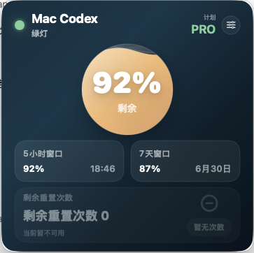
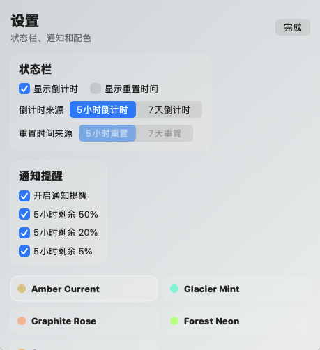

# Codex Token Status

A small native macOS menu bar app for checking local Codex token quota status.

It shows the remaining percentage for the 5-hour window and the 7-day window, reset time or countdown, reset-credit availability, and optional low-quota notifications.

Search keywords: Codex token status, Codex quota, Codex usage, macOS menu bar, token reset time.





## Why This Exists

Codex users who rely on VPN or proxy switching can hit a practical problem: the Codex UI may reconnect, time out, or fail to refresh at the exact moment when you want to know how much usage is left and when the next reset happens.

This app was built for that gap. It keeps a lightweight local quota display outside the Codex window, so the remaining quota and reset time are still visible from the macOS menu bar or a compact floating panel.

## What It Does

- Shows remaining quota for the 5-hour window and 7-day window.
- Shows reset time or countdown in the macOS menu bar.
- Lets you choose how often token data is refreshed from local Codex: 30 seconds by default, 1 minute, 5 minutes, or a custom interval.
- Supports English and Chinese display language, with English as the default.
- Checks GitHub Releases for updates and can download and install the latest `.pkg` from inside the app.
- Shows available reset-credit count and whether reset is currently available.
- Sends optional macOS notifications when the 5-hour window reaches 50%, 20%, or 5%.
- Provides a compact native SwiftUI panel with selectable color themes.
- Caches the last successful display data, so temporary Codex read failures do not immediately blank the UI.
- Reads data from the local Codex app-server only.

## How It Works

The app starts the local Codex command with:

```text
codex app-server --stdio
```

Then it calls the local app-server methods used for quota status:

```text
account/rateLimits/read
account/rateLimitResetCredit/consume
```

No remote quota API is called by this app. It does not upload your quota data anywhere.

## Suitable Use Cases

This app is useful if:

- You use Codex on macOS and want quota status visible outside the Codex window.
- VPN or proxy switching sometimes causes Codex UI reconnects or failed refreshes.
- You want quick menu bar visibility for `5h | 7d` quota percentages.
- You want reset countdown or reset time visible without opening settings pages.
- You want local notifications before the 5-hour quota runs low.

This app is not intended to:

- Provide Codex access by itself.
- Fix VPN or proxy routing problems.
- Read another user's quota.
- Work without a locally installed and logged-in Codex app/CLI.

## Privacy

Quota Status is local-first:

- It reads from the locally installed Codex command.
- It does not include any private server endpoint.
- It does not call a third-party quota service.
- It does not send quota data to the developer.
- It stores only local display preferences and the last successful display snapshot in macOS `UserDefaults`.

## Install From Release

Download either artifact from the GitHub release:

- `QuotaStatus-mac.zip`: unzip and open `QuotaStatus.app`.
- `QuotaStatus-1.0.4.pkg`: installer package that places the app in `/Applications`.

The app is ad-hoc signed and not notarized. On first launch, macOS may block it. If that happens, use right-click `Open`, or allow it from `System Settings -> Privacy & Security`.

## Build Locally

Requirements:

- macOS 13 or later.
- Xcode command line tools.
- Codex installed locally.

Build the app:

```bash
./mac-app/build-mac-app.sh
```

Install to `~/Applications` and open:

```bash
./mac-app/install-mac-app.sh
```

Create a shareable installer package:

```bash
./mac-app/package-mac-app.sh
```

Create a zipped `.app`:

```bash
./mac-app/build-mac-app.sh
cd dist
ditto -c -k --sequesterRsrc --keepParent QuotaStatus.app QuotaStatus-mac.zip
```

## Configuration

If Codex is installed somewhere else, provide the local command path:

```bash
QUOTA_STATUS_CODEX_COMMAND=/path/to/codex ./mac-app/install-mac-app.sh
```

Set a custom display title:

```bash
QUOTA_STATUS_TITLE="My Codex" ./mac-app/install-mac-app.sh
```

The app also accepts:

```bash
open QuotaStatus.app --args --title="My Codex" --codexCommand="/path/to/codex"
```

Token data refresh interval is configurable in the app settings:

- Default: 30 seconds.
- Presets: 1 minute and 5 minutes.
- Custom: any value from 10 seconds to 86400 seconds.

Display language is configurable in the app settings:

- Default: English.
- Optional: Chinese.

## Online Updates

The app can check GitHub Releases from Settings. When a newer release is available, it downloads the latest `.pkg`, verifies the GitHub-provided SHA-256 digest when present, and launches the macOS installer with administrator authorization.

The installer replaces `/Applications/QuotaStatus.app` and reopens the app after installation.

## Menu Bar Display

The menu bar shows a compact line like:

```text
CodeX 92%|87%
```

When countdown or reset time is enabled, a second line is rendered under the percentages while keeping `CodeX` vertically centered.

## Notifications

In settings, enable notification reminders and choose any of:

- 5-hour remaining 50%
- 5-hour remaining 20%
- 5-hour remaining 5%

Each threshold is sent once per reset window.
